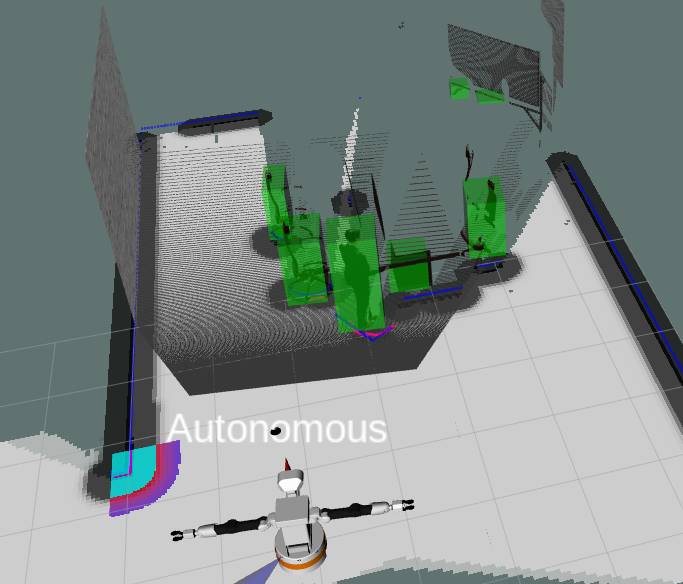
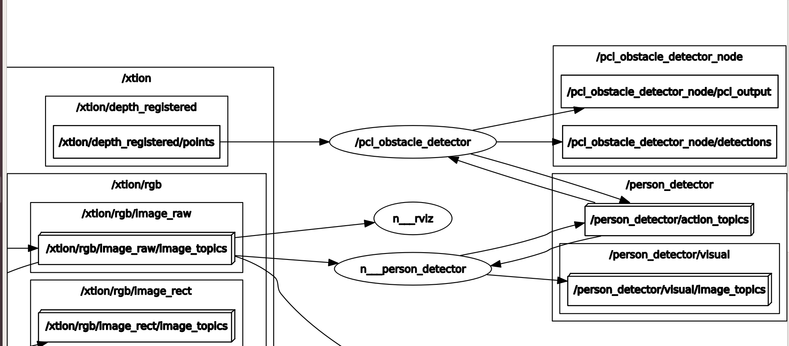

# Pcl_obstacle_detectors node


*Author: Xianzhong Liu*

*E-mail: liuxianzhong9915@gmail.com*


## General information
This package implements the node that does object extraction. It makes use of the depth camera of TIAGo to do this.

### Node introduction

This node receives the depth point cloud from **xtion/depth_registered**. The point cloud is firstly filterd, to remove points far away or on the ground plane. Then it uses **pcl::EuclideanClusterExtraction** to extract objects via clustering. 

If objects are detected, they would be published in topic **/pcl_obstacle_detector_node/detections**. Each object is represented by a bounding box containing their location and size information. 



As shown above, each object is marked in a green bounding box, in both 3D environment (rviz simulation).

This node acts as a action server. Since the node is controlled by the **tiago_behaviour** node, which is the action client, once a person is deteced, the node is shut down by the **tiago_behaviour** node. Hence, you cannot see consecutive outputs now.

The node graph is shown below:




### Output data structure


The detected people's locations are published via **vision_msgs/Detection3DArray**. 

http://docs.ros.org/en/api/vision_msgs/html/msg/Detection3DArray.html

The position of a person can be read from the bouding box center.

http://docs.ros.org/en/api/vision_msgs/html/msg/BoundingBox3D.html


## Get Started

If errors occur during 'catkin build' related to "vision_msgs" use:
```
git clone https://github.com/ros-perception/vision_msgs.git
```
From the catkin_ws/src/ directory. Then compile again by running 'catkin_build'. This would install another package **vision_msgs** to your working space.


To activate perception nodes, run
```
roslaunch tiago_behaviour main.launch
```

In the second window, run

```
roslaunch tiago_behaviour tiago_behaviour_tree.launch
```

In case you want to drive the robot, in the third window, run

```
rosrun key_teleop key_teleop.py
```

