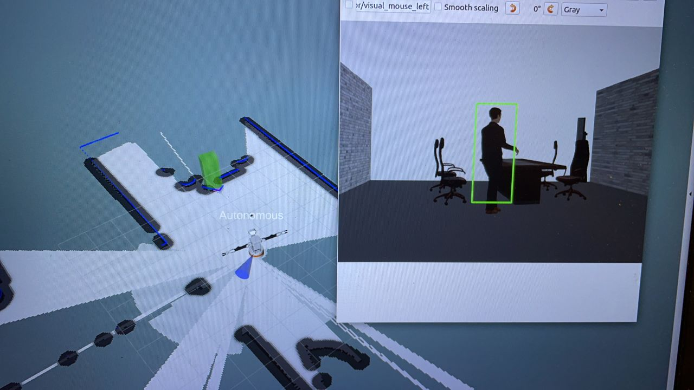
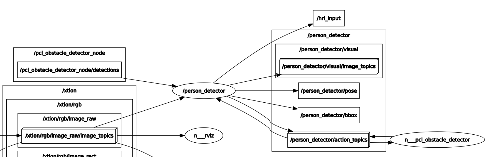

# Person_detector node


*Author: Xianzhong Liu*

*E-mail: liuxianzhong9915@gmail.com*

## General Information
This package implements the node that classifies human beings. It makes use of the camera from TIAGo to do this.

### 1.2 Node introduction

This node receives the output 3d bounding boxes from the **pcl_obstacle_detector** node and the camera image from **xtion/rgb/image_raw**. Then it uses **cv::HOGDescriptor** to determine whether each bounding box contains a human. 

If the box contains a human, the node then publishes the position of the detected human in topic **/person_detector/pose**. And also a bool variable **hri_input** to indicate a human is successfully detected. 



As shown above, a human is marked in a green bounding box, in both 3D environment (rviz simulation) and a 2D camera image.

This node acts as a action server. Since the node is controlled by the **tiago_behaviour** node, which is the action client, once a person is deteced, the node is shut down by the **tiago_behaviour** node. Hence, you cannot see consecutive outputs now. But I put an video **Demo_video.mp4** to show the consecutive detection results. 

The node graph is shown below:




### 1.2 Output data structure

The detected people's locations are published via **geometry_msgs/PoseArray**. 

http://docs.ros.org/en/api/geometry_msgs/html/msg/PoseArray.html

The position of a bounding box can be read from the bouuding box center.

http://docs.ros.org/en/api/vision_msgs/html/msg/BoundingBox3D.html


## Get Started
### 1.1 Instruction on running this node

If errors occur during 'catkin build' related to "vision_msgs", use the following command from the **src/** directory.:
```
git clone https://github.com/ros-perception/vision_msgs.git
cd vision_msgs
git checkout melodic-devel
cd ../..
```
Then compile again by running 'catkin_build'. This would install another package **vision_msgs** to your working space.


To activate perception nodes, run
```
roslaunch tiago_behaviour main.launch
```

In the second window, run

```
roslaunch tiago_behaviour tiago_behaviour_tree.launch
```

In case you want to drive the robot, in the third window, run

```
rosrun key_teleop key_teleop.py
```
