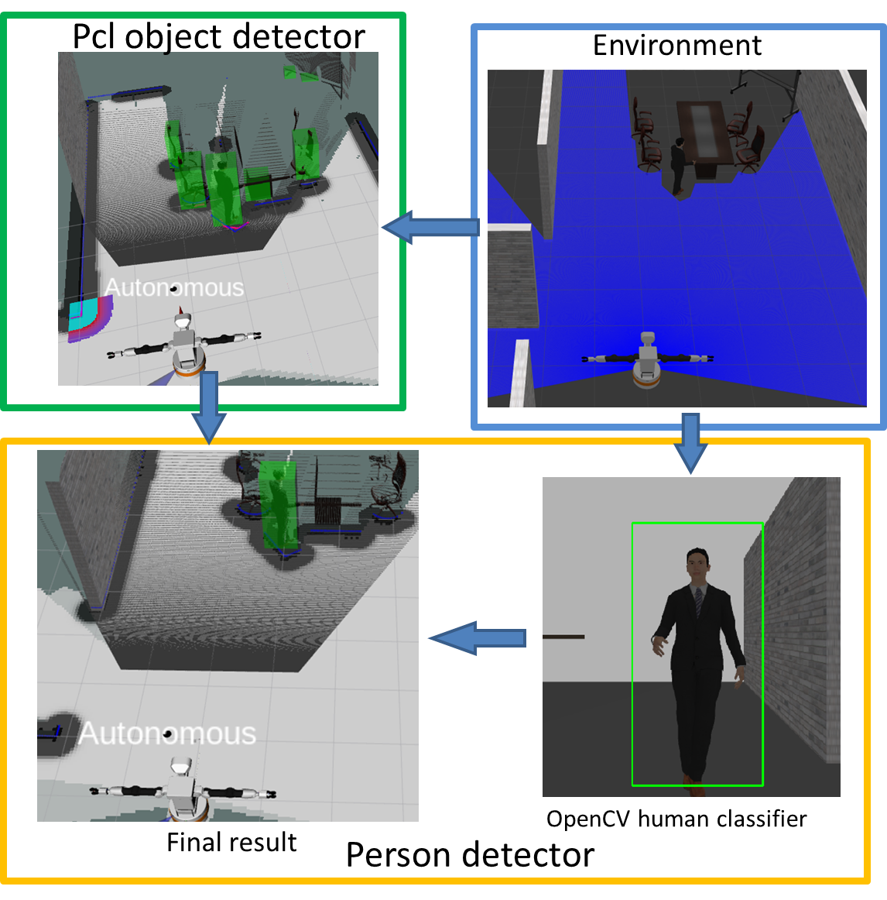
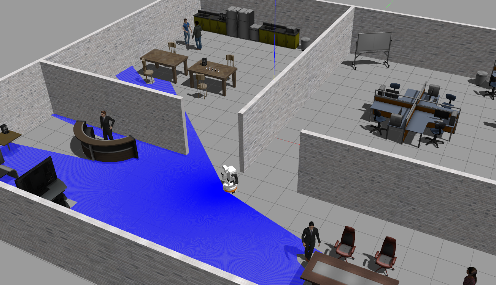

# Tiago Perception Simulation


## Perception nodes

#### **Introduction**

Perception nodes are responsible for detecting and localizing objects from environment. Instead of using the existed packages which could not perform 3D localization, we have rewritten the perception nodes only based on some existed functions from OpenCV and PCL, so that human can directly be detected and localized in 3D world.

There are two sub-nodes for perception:
* pcl_obstacle_detector
* person_detector

The pipeline is shown as follow:


The **pcl_obstacle detector** package detects obstacles using pointclouds from depth camera. The **person_detector** uses the camera and detected obstacles to classify human beings. It outputs the bounding boxes and pose array as output.

**For detailed information, please refer to the readme file under person_detector and pcl_obstacle_detector folder.**

#### **Simulation environment**

The simulation is built upon the Tiago Simulation repository which aims to be a simple one stop shop for simulating Tiago. All dependencies with their exact remote and version are listed in the `.rosinstall`. Using this it is possible to install locally.

**Important:** The only officially supported Ubuntu/ROS version is Bionic/Melodic for the Tiago simulation.

## Local

Create a catkin workspace and clone all required dependencies listed in `cor_mdp_tiago.rosinstall`. To automate the process [vcstool](http://wiki.ros.org/vcstool) can be used:

``` bash
mkdir -p <my_catkin_ws>/src # if no catkin_ws yet
cd <my_catkin_ws>/src
git clone https://gitlab.tudelft.nl/cor/ro47007/2022/team-<XX>/cor_mdp_tiago.git
vcs import --input cor_mdp_tiago/cor_mdp_tiago.rosinstall .
cd ..
```

> Note: replace the `<XX>` with your team number

Next, use rosdep to install other dependencies:
``` bash
sudo rosdep init
rosdep update
rosdep install --from-paths src --ignore-src --rosdistro melodic -y --skip-keys="opencv2 opencv2-nonfree pal_laser_filters speed_limit_node sensor_to_cloud hokuyo_node libdw-dev python-graphitesend-pip python-statsd pal_filters pal_vo_server pal_usb_utils pal_pcl pal_pcl_points_throttle_and_filter pal_karto pal_local_joint_control camera_calibration_files pal_startup_msgs pal-orbbec-openni2 dummy_actuators_manager pal_local_planner gravity_compensation_controller current_limit_controller dynamic_footprint dynamixel_cpp tf_lookup opencv3 joint_impedance_trajectory_controller" 
```
> Note: the skip-keys contain non-essential dependencies and are taken from the official [PAL install instructions](http://wiki.ros.org/Robots/TIAGo%2B%2B/Tutorials/Installation/InstallUbuntuAndROS)

Finally build and source the workspace:
``` bash
catkin build && source devel/setup.bash
```

if errors occur during 'catkin build' related to "vision_msgs", please use the following command in the catkin_ws/src/ directory.:
```
cd <my_catkin_ws>/src
git clone https://github.com/ros-perception/vision_msgs.git
cd vision_msgs
git checkout melodic-devel
```

Then rebuild and source the workspace.


## Quickstart


### Test simulation environment

```
roslaunch cor_mdp_tiago_gazebo tiago_festo.launch
```



### Test perception nodes

To activate perception nodes, run
```
roslaunch person_detector detector.launch
```

To visualize, in the second window, run

```
rosrun rqt_image_view rqt_image_view
```

In case you want to drive the robot, in the third window, run

```
rosrun key_teleop key_teleop.py
```

The detected people's locations are published via **vision_msgs/Detection3DArray**. 

http://docs.ros.org/en/api/vision_msgs/html/msg/Detection3DArray.html

The position of a person can be read from the bouding box center.

http://docs.ros.org/en/api/vision_msgs/html/msg/BoundingBox3D.html


