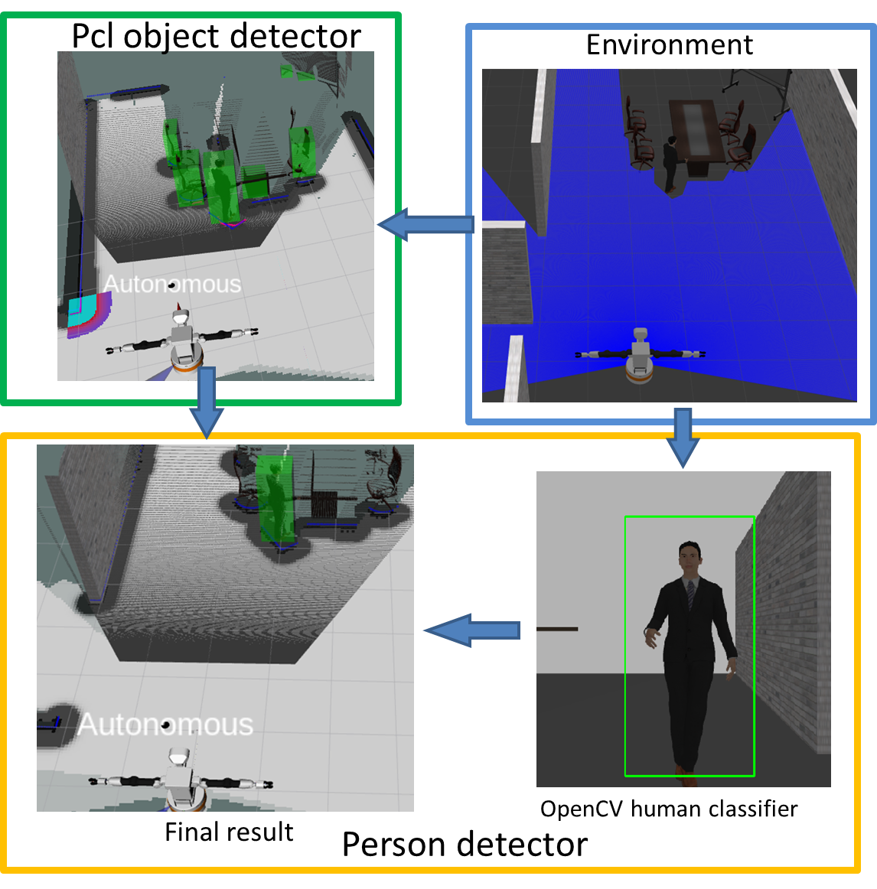
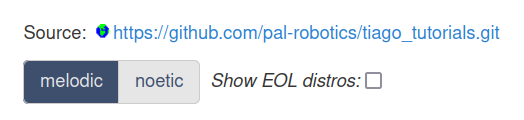
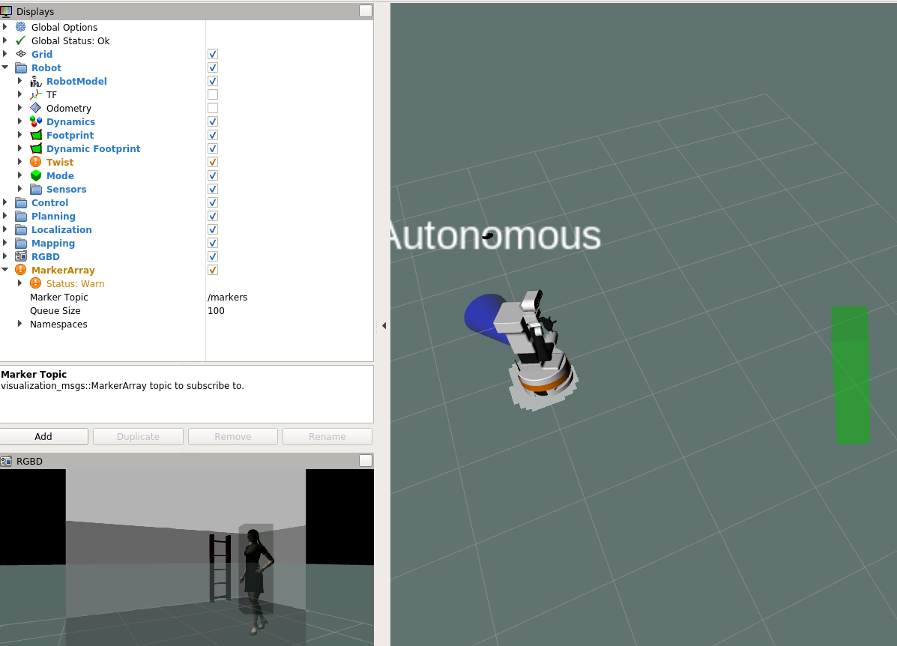

# Tiago Perception Simulation


## Perception nodes

#### **Introduction**

Perception nodes are responsible for detecting and localizing objects from environment. Instead of using the existed packages which could not perform 3D localization, we have rewritten the perception nodes only based on some existed functions from OpenCV and PCL, so that human can directly be detected and localized in 3D world.

There are two sub-nodes for perception:
* **pcl_obstacle_detector**: detecting obstacles using pointclouds from depth camera and outputing 3D bounding boxes.
* **person_detector**: uses the camera and detected obstacles to classify human beings. It outputs the bounding boxes and pose array as output.

The pipeline is shown as follow:

 

**For detailed information, please refer to the readme file under person_detector and pcl_obstacle_detector folder.**

#### **Simulation environment**

The only supported Ubuntu/ROS version is Bionic/Melodic for the Tiago simulation. For non-melodic version, we have provided a docker file to build the image. Or you can use the docker image by following the instruction on [TIAGo Docker turtorial](http://wiki.ros.org/Robots/TIAGo/Tutorials/Installation/Installing_Tiago_tutorial_docker). Please select the melodic version when pulling the image.

## Installation

The simulation is built upon the [Tiago Simulation repository](https://github.com/pal-robotics/tiago_tutorials.git). You can follow the instruction to install and add then the code from this repo. Alternatively, we have also provided the docker file for convenience.

### Installation with Docker 
>Note: Approximately 6GB of space is needed under /var. 
First clone this repo and build the docker image.

``` bash
git clone git@github.com:LiuStan99/TIAGo-Robot-Perception.git
cd TIAGo-Robot-Perception
docker build -t tiago_simulation:melodic .
```

Then install rocker following the instructions on the [tutorial website](http://wiki.ros.org/Robots/TIAGo/Tutorials/Installation/Installing_Tiago_tutorial_docker). **Do not pull the image again since we have already built the image (so skip the first command "docker pull ...").**

After rocker is installed, run the container with the following command
``` bash
rocker --home --user --nvidia --x11 --privileged tiago_simulation:melodic
```
For rocker with intel integrated graphics support: 
``` bash
rocker --home --user --x11 --privileged tiago_simulation:melodic --devices /dev/dri/card0
```
If you are using a version of rocker that is lower than version 0.2.4, you would need to remove the --privileged option

Once you are inside the rocker you can do 
``` bash
terminator -u
```
Finally build the packages
``` bash
cd /tiago_public_ws/
sudo catkin build && source devel/setup.bash
```

### Installation steps without Docker(only for melodic version)
Please first intall the simulation environment (melodic version) following the [instruction](http://wiki.ros.org/Robots/TIAGo/Tutorials/Installation/InstallUbuntuAndROS). 



After installation, clone this repo to the **/src** dir under your worksapce.
``` bash
cd ~/tiago_public_ws ## Path to your workspace
cd src
git clone git@github.com:LiuStan99/TIAGo-Robot-Perception.git
cd ..
```
Finally build and source the workspace:
``` bash
catkin build && source devel/setup.bash
```


## Quickstart


### Test perception nodes
1.Activate simulation environment
```bash
cd /tiago_public_ws && source devel/setup.bash
roslaunch tiago_2dnav_gazebo tiago_mapping.launch public_sim:=true world:=simple_office_with_people
```
2.Activate perception nodes

Open another terminal and run
```
source devel/setup.bash
roslaunch person_detector detector.launch
```
3.Visualization

To visualize, in the third window, run

```
source devel/setup.bash
rosrun rqt_image_view rqt_image_view
```
You should be able to see 2D Bbox on human. 

**To see a 3D Bbox, add a MarkerArray in the rviz.**


4.Move robot around

In case you want to drive the robot, in the fourth window, run

```
source devel/setup.bash
rosrun key_teleop key_teleop.py
```

The detected people's locations are published via **vision_msgs/Detection3DArray**. 

http://docs.ros.org/en/api/vision_msgs/html/msg/Detection3DArray.html

The position of a person can be read from the bouding box center.

http://docs.ros.org/en/api/vision_msgs/html/msg/BoundingBox3D.html


